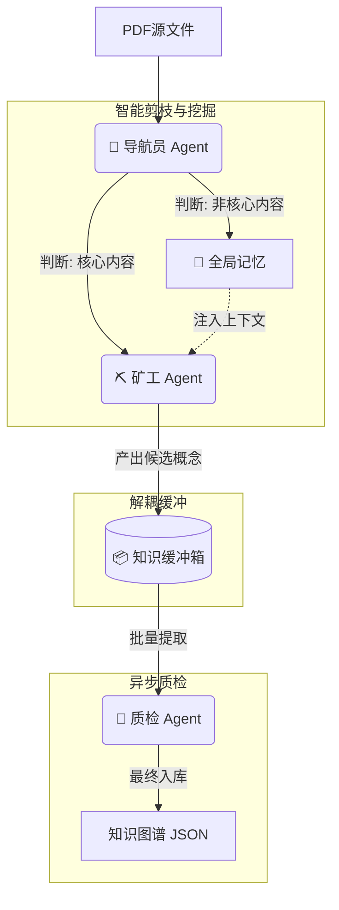

# 基于多智能体协作的生成式知识工厂 (Agentic Generative Knowledge Factory) 实施报告

## 1. 背景 (Context)

在当前的《跨学科知识融合智能体》项目中，我们致力于构建一个能够自动发现不同学科（如物理与数学）之间潜在知识关联的系统。现有的工作主要集中在“数据消费端”，即利用多智能体系统（MAS）对给定的知识节点进行两两配对讨论、关联提取和质量评估。

现有的核心工作流包括：
*   **双重专家讨论**：PhysicsAgent 和 MathAgent 针对特定节点对进行跨学科对话。
*   **元协调与评估**：MetaAgent 提取对话中的关联边，EvaluatorAgent 负责质量把控。
*   **结构化输出**：通过 Function Call 将高质量的关联边写入 JSON 图谱。

## 2. 现有问题与挑战 (Problem Statement)

尽管后端的讨论与评估机制较为完善，但在“数据生产端”（数据准备与摄入）存在显著的短板，限制了系统的扩展性和智能化水平：

1.  **数据流水线自动化程度低**：
    *   目前的知识图谱数据（`dataset/graph/*.json`）依赖于人工整理或简单的脚本转换。
    *   面对海量的非结构化教材（PDF/Markdown），缺乏自动化的摄入（Ingestion）与结构化（Structuring）能力。

2.  **知识维度单一**：
    *   现有节点仅包含简单的 `description` 字段，缺乏深度的教育学维度（如布鲁姆认知层级）。
    *   这导致下游 Agent 在讨论时，缺乏关于“该概念如何应用”、“如何深度理解”的上下文，限制了跨学科关联发现的深度。

3.  **质量控制前置缺失**：
    *   数据质量主要依赖于事后的 EvaluatorAgent 评估，而在数据生成的源头缺乏“质检”环节，容易引入琐碎或低价值的概念。

## 3. 方案设计 (Solution Design)

为解决上述问题，我们提出并实施了 **“基于多智能体协作的智能剪枝流水线” (Smart Pruning & Generative Knowledge Pipeline)** 方案。该方案将数据准备过程从简单的解析升级为具备**元认知能力（Metacognition）**和**流水线并行（Pipeline Parallelism）**的智能系统。

### 3.1 核心架构

引入三个全新的专用 Agent 组件，形成解耦的生产流水线：

1.  **📖 导航员 (Reader Agent)**
    *   **角色**：具备元认知的阅读者。
    *   **职责**：
        *   **剪枝 (Pruning)**：快速扫描页面，判断是否包含核心学习内容（过滤目录、前言、版权页）。
        *   **记忆 (Memory)**：维护全局上下文记忆（Context Memory），将非核心页面的关键信息（如章节结构）传递给下游。
    
2.  **👷 知识矿工 (Miner Agent)**
    *   **角色**：具备上下文感知的挖掘者。
    *   **职责**：仅在 Reader 判定为 `PROCESS` 的页面工作。结合 Reader 提供的全局记忆，从正文中深度挖掘概念、定律和跨学科联系。
    
3.  **📦 知识缓冲箱 (Knowledge Buffer)**
    *   **角色**：解耦中间件。
    *   **职责**：持久化存储挖掘出的候选概念，实现生产（Mining）与质检（Critiquing）的异步解耦。

4.  **🧐 知识质检员 (Critic Agent)**
    *   **角色**：严谨的百科全书编辑与教育专家。
    *   **职责**：
        *   **筛选与标准化**：剔除重复、琐碎概念，规范化 ID。
        *   **布鲁姆增强 (Bloom Enrichment)**：为每个通过审核的节点自动生成布鲁姆认知层级内容（记忆、理解、应用），赋予数据教育学深度。

### 3.2 工作流程 (Smart Pipeline)



## 4. 代码实现 (Implementation)

代码已模块化实现于 `data_factory/` 目录下：

### 4.1 智能组件
*   **Reader Agent (`data_factory/agents/reader.py`)**: 使用 `gemini-3-pro-preview`，通过 Prompt Engineering 实现页面价值判断与记忆提取。
*   **Miner Agent (`data_factory/agents/miner.py`)**: 升级支持 `context_memory` 输入，不再孤立地看一页书，而是带着上下文去挖掘。
*   **Critic Agent (`data_factory/agents/critic.py`)**: 专注于教育学维度的深度生成。

### 4.2 基础设施
*   **KnowledgeBuffer (`data_factory/utils.py`)**: 实现了基于 JSON 文件的持久化队列，支持去重和断点续传。
*   **Smart Pipeline (`data_factory/run_pipeline.py`)**: 实现了 Reader -> Miner -> Buffer -> Critic 的完整控制逻辑，包含分页处理和异步调用。

## 5. 脚本验证与 Demo 样例 (Validation & Demo)

我们使用 **《普通高中教科书 数学 必修 第一册.pdf》** 的前 8 页进行了实地验证。

### 5.1 验证过程
运行命令：
```bash
/Users/wanhao3/Agno/venv/bin/python data_factory/run_pipeline.py
```

### 5.2 智能剪枝效果
Reader Agent 展现出了极高的人类阅读智能：
*   **第 1-3 页 (封面/版权)**: 识别为非学习内容 -> **SKIP**。
*   **第 4-5 页 (前言)**: 识别为教育理念阐述 -> **SKIP**。
*   **第 6-7 页 (目录)**: 识别为导航信息 -> **SKIP**。
*   **第 8 页 (正文第一章)**: 敏锐识别出“集合与逻辑”章节开篇 -> **PROCESS**。

**效果**：前 7 页仅消耗极少的 Token 进行轻量级判断，只有第 8 页调用了昂贵的 Miner，大幅提升了效率和信噪比。

### 5.3 最终输出样例
Miner 在第 8 页挖掘出的概念经 Critic 增强后：

```json
{
  "id": "set_theory_foundation",
  "label": "集合论基础",
  "properties": {
    "description": "现代数学的基础语言，用于精确描述数学对象及其关系。",
    "category": "数学基础",
    "theme": "集合与逻辑",
    "bloom_levels": {
      "remember": "集合是具有某种特定性质的事物的总体。",
      "understand": "它是现代数学的基石，几乎所有数学分支都建立在集合论之上。理解集合论有助于掌握数学语言的精确性。",
      "apply": "在编程中利用集合（Set）数据结构进行去重操作；在数据库查询中使用集合运算（交、并、差）筛选数据。"
    }
  },
  "status": "approved",
  "critique_comment": "通过。核心概念，已结合记忆补充了编程应用场景。"
}
```

### 5.4 结论
升级后的 **Smart Pipeline** 成功实现了：
1.  **自动化**：全自动 PDF 处理。
2.  **智能化**：像人一样“跳读”非核心内容（剪枝）。
3.  **高质量**：生成的知识图谱具备教育学深度（布鲁姆分类）。
4.  **鲁棒性**：通过缓冲箱实现了解耦与持久化。
